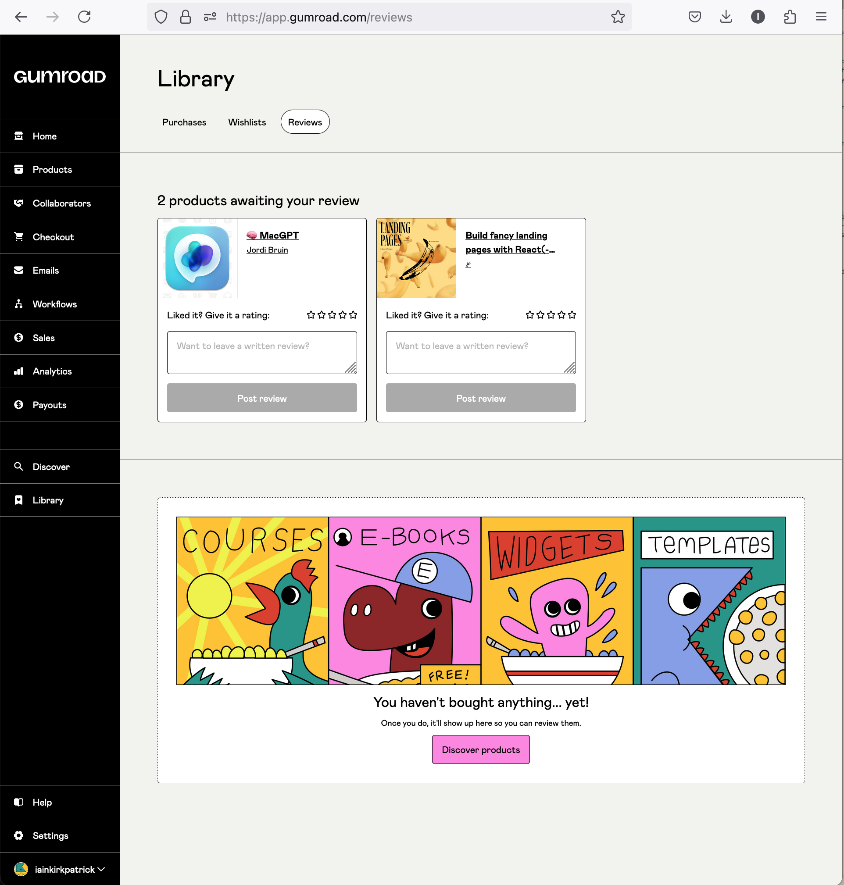

# gumroad-demo

A deployment of select functionality of Gumroad, to demo implementations of the Coffee, Commissions, and Calls features as part of the Engineering challenge for Hiring.

Deployed at [https://gumroad-demo.com](https://gumroad-demo.com).

## overview

As well as writing a scope of changes for implementing roadmap features from the [latest Gumroad board meeting](https://www.youtube.com/watch?v=CNes_Qfo0gw), I wanted to actually build them out within a demo "shell" of Gumroad. The idea of the shell is that it looks and functions roughly the same as production Gumroad for necessary flows to show off the roadmap features (without being pixel-perfect), in order to give a sense of what using these features might feel like. Actual purchasing of products is fake but should resemble a flow similar to the real Gumroad.

In general, I've tried to implement simple changes with minimal differences in Gumroad data structures and UI in order to achieve the feature functionality.

The thinking for each feature:

- Coffee
  - as per the board meeting, the concept is that creators can offer a product which directly allows customers to support the creator
  - also as per the board meeting, the idea is that a coffee product gets automatically added to a customer's cart when purchasing other products from the creator - a form of tipping
  - coffee product has tiers like the membership product - creators can define separate price points similar to tipping brackets. First tier is the tier automatically selected for the cart
  - creator can add a "thanks" message, which renders above the coffee product in the cart - opportunity for the creator to personalise the tip and incentivise leaving it in the cart
    - considered implementing a different "thanks" message per tier, but think it's simpler with a single message (creators can use the tier description for per-tier information)
  - user can change the selected tier in-cart as per membership
  - user can remove the coffee product from the cart
  - UI / UX:
    - similar to the UI of a "bundle" product to differentiate it from other products, but with a customisable "thanks" message from the creator (as per above)

- Commissions
  - concept is that customers can pay a part of a product's cost up-front, and then discuss details with the creator as to the completion of the rest of the product
  - a simple implementation is with tiers, again similar to memberships and coffee - the creator can offer various tiers of pricing for lower / greater effort commissions.
  - user can change the selected tier in-cart as per membership
  - the customer provides an email automatically to be contacted on post-purchase, and the creator can also provide contact details or additional instructions in the content of the product once purchased.

- Calls
  - concept is that customers can purchase video calls with the creator
  - video calls are handled via a third-party platform like Calendly or Cal.com (additional platforms could be added over time)
  - the customer essentially purchases access to the calendar of the creator, and can book in for a time as specified by that calendar's settings in the third-party provider
  - I first went down the path of a custom tiptap extension to embed the calendar widget in the product content, but think it's better for the creator to explicitly include the link to their calendar which is shown embedded above other content  
  - could be useful for creators to still include regular rich content alongside the calendar widget, if they want to provide additional details / explanations of process etc.

## scope

- Migrations:
  - Coffee:
    - add a "thanks_message" (string) field to Products ("Links" table in Gumroad?)
  - Commissions:
    - (no migrations necessary)
  - Calls:
    - add a "call_link" (string) field to Products
- Notable code implementation / changes:
  - Coffee:
    - always add a Coffee product, if one exists for the creator, to the customer cart when they add a different product - [carts_controller.rb](./app/controllers/carts_controller.rb) (update)
  - Calls:
    - Validation on what string can be added as a call_link to a Product, including CSP for calendly.com or cal.com
      - client-side in [CallsWidget.tsx](./app/javascript/components/CallsWidget.tsx) and [validateCallLink.ts](./app/javascript/utils/validateCallLink.ts)
      - server-side in [product.rb](./app/models/product.rb) (call_link_format)
    - simple React widget to render the form for a call link, or if a link is present, render the iframe embed for the calendar in [CallsWidget.tsx](./app/javascript/components/CallsWidget.tsx) 

## further questions / improvements

- Coffee
  - percentage-based pricing as an option? i.e. 10% of the total cart cost? 
  - should there be a limit of a single coffee product per creator? This would simplify some logic in terms of automatically adding it to a cart, and it's hard to imagine good reasons why creators would need more than one if they can add additional tiers to their single coffee product.

- Commissions
  - will customers feel comfortable paying up-front before any kind of discussion with the creator? do they need some additional reassurance about the ability to ask for a refund if they aren't happy with the process post-purchase? Getting the balance right between customer satisfaction and creator happiness (and avoiding chargebacks) seems pretty important.

- Calls
  - could imagine a subscription approach similar to memberships being desirable here - i.e. life-coaching services etc where there is a monthly call booked at the same time? It [doesn't look like Calendly supports recurring bookings currently](https://community.calendly.com/how-do-i-40/please-create-a-recurring-meeting-758) but [Cal.com does](https://cal.com/scheduling/feature/recurring-events). Support from the calendar tool would be nice, but even without it, the onus could be on the creator to make sure the booking is made (manually) at the regular time far enough in advance to avoid clashes.
  - there isn't a way currently to stop a customer buying access to the creator's calendar once, and booking themselves onto many calls - Calendly at least [doesn't appear to have a great solution for this](https://community.calendly.com/how-do-i-40/same-person-booking-the-same-event-twice-1449), it's left as a manual exercise for the calendar owner to remove repeat bookings.
  - could imagine some upside to having a Gumroad calendar widget which allows total control over the UI / UX of booking, and just sends booking data to calendar provider API's. I think the cost / benefit seems pretty hard to justify though, at least in the first instance.

- general Gumroad thoughts
  - it'd be nice to have a more direct avenue to publishing a product - perhaps from the products list page table? Currently I have to navigate into the product, to the content page, and then click "publish and continue". Granted, most users probably aren't publishing / un-publishing / re-publishing a lot.
  - my personal account Library page has a CTA at the bottom suggesting I haven't bought anything yet, but I have two products in my library? See screenshot 

## implementation details

- rails + react (specifically, [Vite Ruby](https://vite-ruby.netlify.app/))
- hosted on [Railway](https://railway.app/)
- unit tests with minitest, e2e tests with [Playwright](https://playwright.dev/)
- CI / CD using Github Actions
- [Caddy](https://caddyserver.com/) for local development with correct demo subdomain